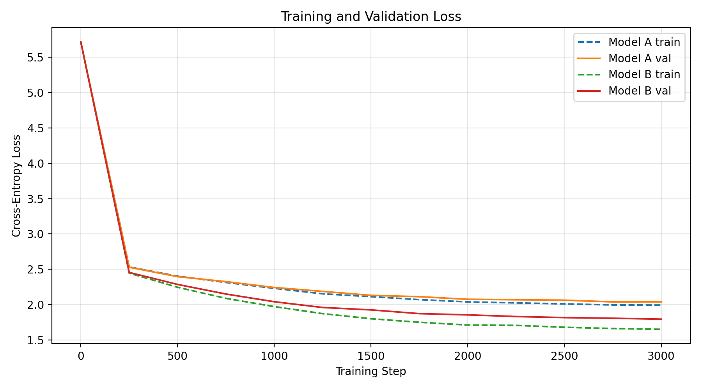
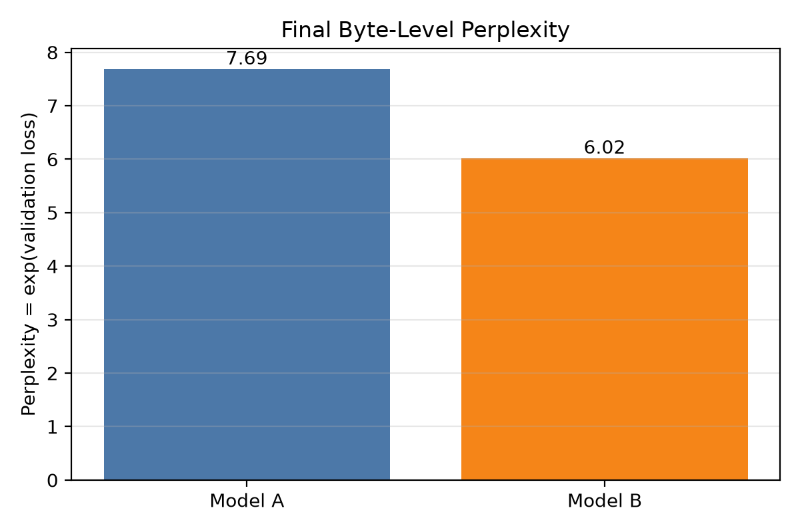

# Model Comparison





## Summary

This project reimplements Karpathy’s scalar microGPT blueprint as a vectorized PyTorch transformer trained on the Tiny Shakespeare dataset. It compares a small baseline model against a scaled version using the same byte-level tokenizer, training budget, and evaluation prompts.

## Setup and Run

Tested with Python 3.12 and PyTorch 2.13.0 CPU.

**Note:** Checkpoints were used to save the trained Model A and B weights so evaluation, generation, and comparison could be reproduced without retraining each model every time.

Install dependencies:

```powershell
python -m pip install -r requirements.txt
```

Train both local models with the same step budget:

```powershell
python my-transformer/train.py --model A
python my-transformer/train.py --model B
```

Recompute metrics and charts:

```powershell
python evaluation/metrics.py --checkpoint my-transformer/ckpt_A.pt
python evaluation/metrics.py --checkpoint my-transformer/ckpt_B.pt
python evaluation/plot_losses.py
```

Generate a fixed-length local completion:

```powershell
python evaluation/generate.py --checkpoint my-transformer/ckpt_A.pt --prompt "O Romeo, Romeo! wherefore art thou " --out evaluation/outputs/model_A_Romeo.txt
```

Each prompt used for completion is in evaluation/prompts.txt.

The fixed-length local decoding outputs are saved in `evaluation/outputs/`. Each Model A and Model B file contains the original prompt plus exactly 150 generated byte-level tokens.

## Repository Layout

```text
README.md           Project overview, charts, results, and run instructions
requirements.txt    Python package dependencies
input.txt           Tiny Shakespeare training corpus
.gitignore          Files excluded from git

my-transformer/
  config.py          Model A and Model B hyperparameters
  data.py            Tiny Shakespeare byte tokenizer and batch sampler
  model.py           PyTorch transformer architecture
  train.py           Training loop, loss logging, and checkpoint saving
  loss_log_A.csv     Model A training/validation loss log
  loss_log_B.csv     Model B training/validation loss log

evaluation/
  generate.py        Checkpoint loading and text generation
  metrics.py         Validation loss and perplexity evaluation
  plot_losses.py     Loss and perplexity chart generation
  prompts.txt        Fixed evaluation prompts
  outputs/           Model A, Model B, and Gemini Flash completions
```

## Results

| Model | Final Val Loss | Byte-Level Perplexity |
|---|---:|---:|
| A | 2.0399 | 7.6899 |
| B | 1.7955 | 6.0227 |

Note: byte-level perplexity is only meaningful for comparing Model A vs Model B in this project.


| Prompt | Model | Structural stability | Shakespearean styling | Repetition loops? |
|---|---|---|---|---|
| Come, cousin, canst thou quake, | Model A | **Low** - malformed words and a broken second line undermine continuity. | **Low** - “thould” and “gonst” hint at archaic diction, but the phrasing is not convincingly Shakespearean. | **Minor** - repeats “the” and “his,” but no fragment dominates the full continuation. |
| Come, cousin, canst thou quake, | Model B | **Medium** - mostly recognizable words and phrases, though the thought remains incomplete. | **Medium** - dramatic line breaks and words such as “heir” and “grace” suggest the genre inconsistently. | **Minor** - “to me” repeats near the start, without becoming a sustained loop. |
| Come, cousin, canst thou quake, | Gemini Flash | **High** - a complete, grammatical question continues naturally across two balanced lines. | **High** - “pale thy cheek” and the storm image sustain a clear Elizabethan dramatic voice. | **No obvious loop** - the continuation develops one image without repeated fragments. |
| O Romeo, Romeo! wherefore art thou | Model A | **Low** - malformed words and abrupt phrase changes prevent a coherent sentence. | **Low** - the prompt supplies most of the Shakespearean signal; the continuation lacks stable dramatic phrasing. | **Yes** - “my my my” is an obvious local repetition loop. |
| O Romeo, Romeo! wherefore art thou | Model B | **Medium** - readable clauses and a speaker label appear, but syntax and meaning remain weak. | **Medium** - verse layout and “GLOUCESTER” imitate drama, though diction is inconsistent. | **Minor** - “the” and “to” recur noticeably, but do not dominate the continuation. |
| O Romeo, Romeo! wherefore art thou | Gemini Flash | **High** - coherent, grammatical lines complete the thought cleanly. | **High** - the response preserves Juliet's dramatic cadence and genre-appropriate diction. | **No obvious loop** - repeated “Romeo” is purposeful source phrasing, not degeneration. |
| Now is the winter of our discontent | Model A | **Low** - broken clauses, invented words, and an abrupt speaker change disrupt structure. | **Low** - a play-like label appears, but the surrounding language does not sustain the style. | **No obvious loop** - the output drifts without heavily repeating a phrase. |
| Now is the winter of our discontent | Model B | **Medium** - line and speaker structure are stable, but sentence continuity is weak. | **Medium** - “gracious,” “thee,” and dialogue formatting evoke Shakespeare unevenly. | **Minor** - “by” repeats locally, but no phrase fragment dominates. |
| Now is the winter of our discontent | Gemini Flash | **High** - a fluent two-line continuation maintains grammar and a unified image. | **High** - metaphor, rhythm, and elevated diction strongly fit the genre. | **No obvious loop** - the image progresses without repeated wording. |
| To be or none or little; | Model A | **Low** - several malformed words and truncated speaker turns make the passage unstable. | **Low** - speaker labels suggest drama, but the continuation has little credible Elizabethan phrasing. | **No obvious loop** - repeated roots such as “com-” are noticeable, but not a dominating phrase loop. |
| To be or none or little; | Model B | **Medium** - mostly readable clauses and stable line breaks, despite malformed words and an unfinished ending. | **Medium** - “gonest,” “thee,” and the speaker label create intermittent Shakespearean flavor. | **No obvious loop** - the continuation changes phrases rather than cycling through one fragment. |
| To be or none or little; | Gemini Flash | **High** - a coherent grammatical statement develops the prompt into a complete idea. | **High** - “'tis,” “mortal crown,” and the measured cadence sustain an Elizabethan tone. | **No obvious loop** - no phrase or short-word cycle appears. |

### Production-model method

The production baseline is **Gemini Flash**, evaluated on the four lines in `evaluation/prompts.txt`. It was asked to continue each line in Shakespearean style, preserve the original line, and limit each continuation to 150 characters so that its output length was comparable to Models A and B. The resulting text is saved in `evaluation/outputs/gemini_flash.txt`.

## Hyperparameter Log

| Setting | Model A | Model B |
|---|---:|---:|
| Model role | Baseline | Scaled |
| Layers (`n_layer`) | 2 | 4 |
| Attention heads (`n_head`) | 4 | 4 |
| Embedding size (`n_embd`) | 64 | 128 |
| Head dimension | 16 | 32 |
| Context window (`block_size`) | 64 bytes | 128 bytes |
| Batch size | 32 | 16 |
| Vocabulary size | 256 UTF-8 byte IDs | 256 UTF-8 byte IDs |
| Dropout | 0.1 | 0.1 |
| Optimizer | AdamW | AdamW |
| Learning rate | 0.001 with linear decay to 0 | 0.001 with linear decay to 0 |
| Max steps | 3000 | 3000 |
| Eval interval | Every 250 steps | Every 250 steps |
| Eval batches | 50 | 50 |
| Random seed | 4397 | 4397 |
| Device | CPU / fp32 | CPU / fp32 |
| Parameter count | 135,168 | 868,352 |
| Final train loss | 1.9943 | 1.6521 |
| Final validation loss | 2.0399 | 1.7955 |
| Final byte-level perplexity | 7.6899 | 6.0227 |
